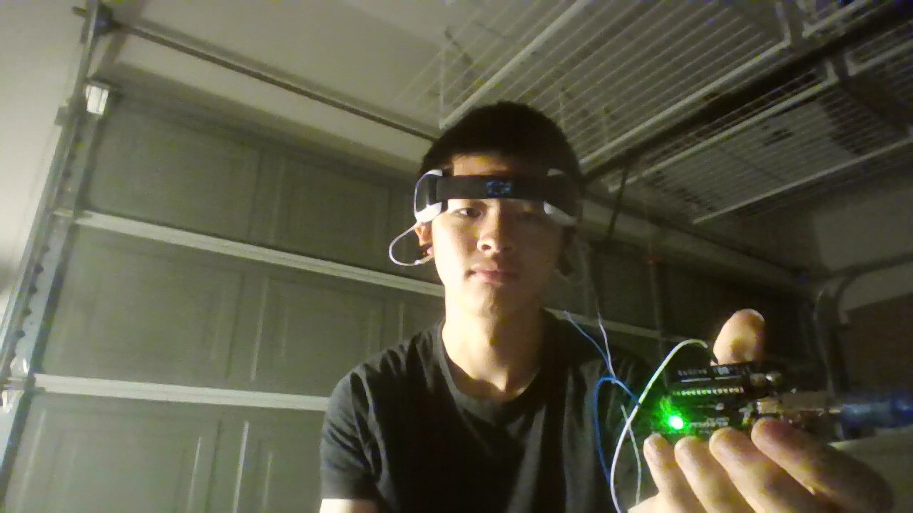
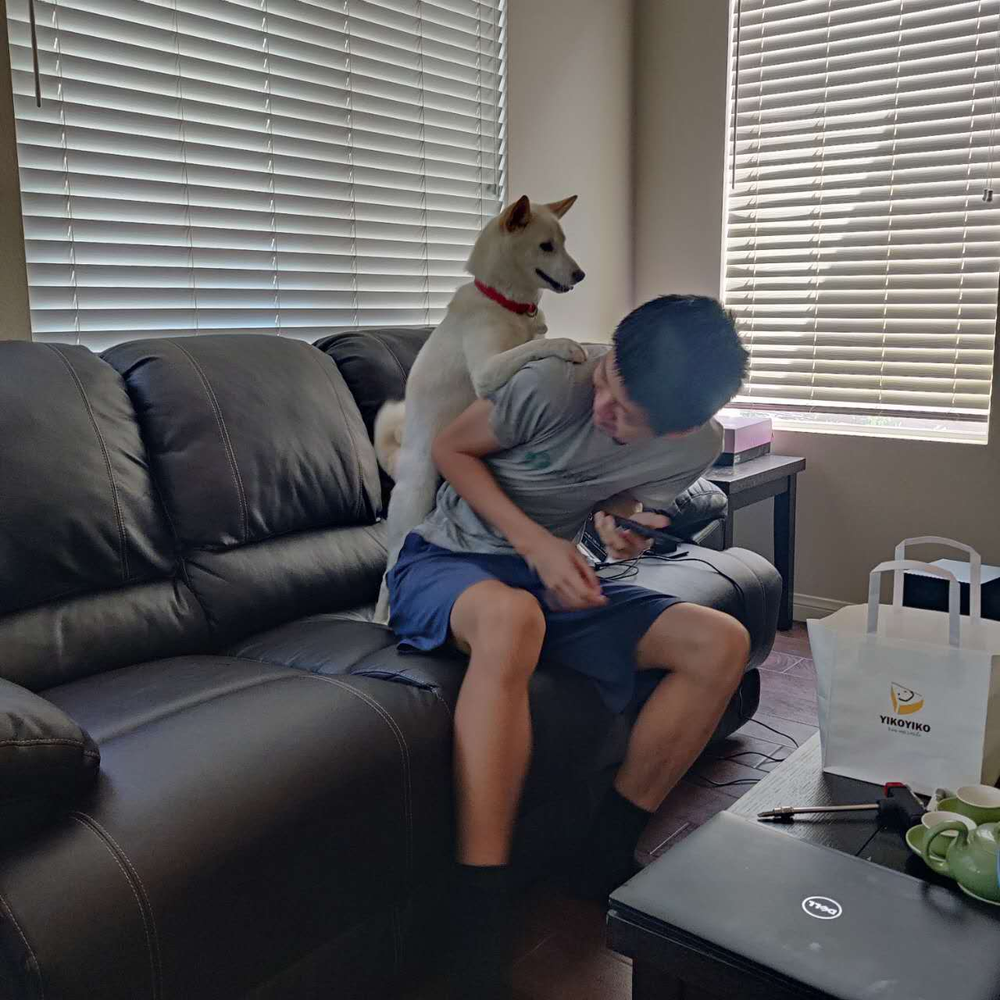

## Who am I??
I am Jonathan Liu, and I started coding via horrible Unity games in around sixth grade, but I didn't take programming as seriously as I did until now. 
 

I have experience in the following languages:
C++,HTML,Javascript,CSS,Python, and Unity C#.

I like to play electric/acoustic guitar, piano, play badminton, code, and do 3D art. 

Here are some projects I've worked on:

A chatting application with the Firebase database, [Crescent](https://spooketti.github.io/Crescent/)

<iframe width="560" height="315" src="https://spooketti.github.io/Crescent/"></iframe>

A clone of Wordle I made whilst in English class, [Wordle Clone](https://3pb65i.csb.app/)
<iframe width="560" height="315" src="https://3pb65i.csb.app/"></iframe>

A clone of Minesweeper I made because I hated not being able to use keyboard controls for the game, [Minesweeper](https://spooketti.github.io/minesweeper)
<iframe width="560" height="315" src="https://spooketti.github.io/minesweeper"></iframe>

An (admittedly buggy) version of Solitaire I wrote while on a roadtrip, [Solitaire](https://spooketti.github.io/solitaire/)
<iframe width="560" height="315" src="https://spooketti.github.io/solitaire/"></iframe>

 A project involving Python, Arduino, Serial Ports, and Minecraft 

<iframe width="560" height="315" src="https://www.youtube.com/embed/cMuKp44WRo8" title="YouTube video player" frameborder="0" allow="accelerometer; autoplay; clipboard-write; encrypted-media; gyroscope; picture-in-picture; web-share" allowfullscreen></iframe>

This was part of a project regarding reading brainwaves, soldering, and Arduino.

And many other projects that aren't noted here such as [this](https://spooketti.github.io/fivenights)

Thanks for stopping by!

<button id='bruh' data-url="https://www.youtube.com/watch?v=dQw4w9WgXcQ&pp=ygUXbmV2ZXIgZ29ubmEgZ2l2ZSB5b3UgdXA%3D"  onclick="window.location.href = this.dataset.url;">Mystery Button</button>

## Overview of Hacks, Study and Tangibles
Blogging in GitHub pages is a way to learn and code at the same time. 

- Plans, Lists, [Scrum Boards](https://clickup.com/blog/scrum-board/) help you to track key events, show progress and record time.  Effort is a big part of your class grade.  Show plans and time spent!
- [Hacks(Todo)](https://levelup.gitconnected.com/six-ultimate-daily-hacks-for-every-programmer-60f5f10feae) enable you to stay in focus with key requirements of the class.  Each Hack will produce Tangibles.
- Tangibles or [Tangible Artifacts](https://en.wikipedia.org/wiki/Artifact_(software_development)) are things you accumulate as a learner and coder. 
